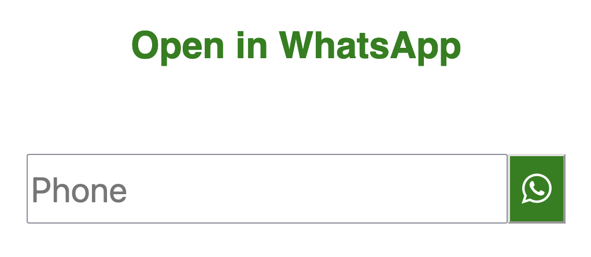

# Open WhatsApp conversation without saving to contacts

I have a creative cousin. He uses WhatsApp a lot, and he is lazy.  
He was tired of saving random people to his contacts only to open a WhatsApp conversation with them.  

> *Sometimes you just need to message and you don't want to save on the agenda.*  
>
> -- Said [Pedro](https://www.instagram.com/pedro.lcosta/).

**[So here is my take.](https://alexandremcosta.github.io/start_whatsapp/)**  

You can check the code <a href="https://github.com/alexandremcosta/start_whatsapp/blob/main/index.html">here</a>. It's very simple!  
You can add to your phone home screen, and it will feature a nice black icon :).  
